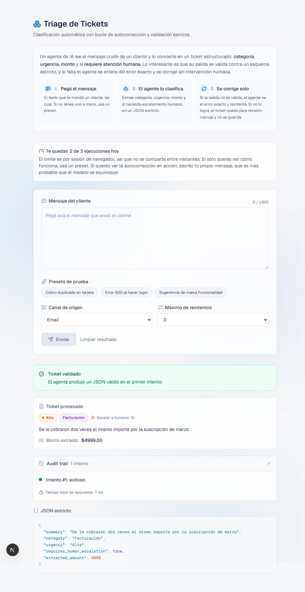
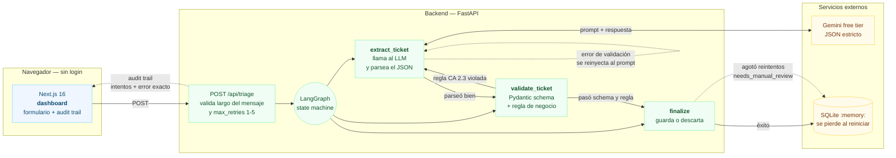

# Triage de Tickets

> ### Un agente LLM que convierte mensajes crudos de clientes en tickets estructurados, y un harness que garantiza que nada inválido llegue a la base: schema estricto, error reinyectado al prompt, reintentos acotados, y estado de revisión manual cuando no se puede arreglar.

El valor del proyecto está en la segunda mitad de esa frase. La clasificación es una
llamada a una API; el harness es el producto.



`Next.js` · `FastAPI` · `LangGraph` · `Pydantic` · `Gemini` · `SQLite` · `GSAP` ·
`Tailwind` · `pytest` · `Jest` · `Playwright` — **151 tests, cero costo de API, sin Docker.**

---

## Índice

- [Qué hace](#qué-hace)
- [Cómo funciona](#cómo-funciona)
- [El grafo](#el-grafo)
- [La inyección del error](#la-inyección-del-error)
- [Los tres estados terminales](#los-tres-estados-terminales)
- [Con qué herramientas](#con-qué-herramientas)
- [Cómo lo desarrollamos](#cómo-lo-desarrollamos)
- [Tests](#tests)
- [Arrancar](#arrancar)
- [Accesibilidad](#accesibilidad)
- [Límites conocidos](#límites-conocidos)

---

## Qué hace

1. El usuario pega el mensaje que envió un cliente, o usa uno de los 3 presets.
2. El agente produce un JSON con `summary`, `category`, `urgency`,
   `requires_human_escalation` y `extracted_amount`.
3. Un validador Pydantic revisa el JSON contra el schema, más una regla de negocio: si la
   categoría es Facturación o la urgencia es Crítica, el summary no puede ser genérico.
4. Si algo falla, el error exacto vuelve al prompt y el agente reintenta.
5. El resultado se muestra con badges, el JSON con syntax highlighting, y el audit trail
   con cada intento y su error.

### El schema

```python
class ExtractedTicket(BaseModel):
    summary: str = Field(min_length=5)
    category: Category        # Facturación | Técnico | Cuenta | Sugerencia
    urgency: Urgency          # Baja | Media | Alta | Crítica
    requires_human_escalation: bool
    extracted_amount: float | None = None

    model_config = {"extra": "forbid"}
```

`extra: "forbid"` evita que el modelo smugglee campos que nunca llegarían a la base. Los
enums rechazan cualquier valor fuera de la lista, así que un `"Finanzas"` o un `"Urgente"`
saltan un `ValidationError` sin código extra.

---

## Cómo funciona



El diagrama es [Mermaid](https://mermaid.js.org), no una imagen: se versiona como texto y
se edita con un diff. El fuente está en [`docs/architecture.mmd`](docs/architecture.mmd).

### Qué resuelve

Los LLM no cumplen schemas de forma confiable. Le pedís un enum cerrado y devuelve
`"Finanzas"`. Le pedís un resumen y devuelve `"problema con la factura"`. La mayoría de las
integraciones agarran el string, hacen un `json.loads` con un `try/except` y lo mandan.

Este proyecto es la versión disciplinada, y **la garantía es negativa**: nada inválido
llega a la base. Eso es lo que está cubierto por tests, no por descripción.

---

## El grafo

Tres nodos en un `StateGraph` de LangGraph, con dos aristas condicionales:

- **`extract_ticket`** llama al LLM y parsea la salida. Si el JSON no parsea o no cumple el
  schema, registra un intento fallido y guarda el error.
- **`validate_ticket`** aplica la regla de negocio. Acá se decide el veredicto del
  intento, porque un ticket puede pasar el schema y ser rechazado igual.
- **`finalize`** guarda si hubo ticket, o marca `NEEDS_MANUAL_REVIEW`.

Dos detalles de implementación que importan:

- El router después de `extract_ticket` **siempre** manda un ticket parseado a
  `validate_ticket`. Ir directo a `finalize` saltearía la regla de negocio. Ese bug existió.
- El estado usa un reducer, `Annotated[list[AttemptLog], lambda a, b: a + b]`. Sin eso cada
  nodo sobrescribiría la lista en vez de agregar a ella. Hay un test que verifica que los
  números de intento sean `[1, 2, 3]`.

---

## La inyección del error

El mensaje de reintento incluye el error textual exacto, no un "algo falló":

```
Tu intento anterior falló con: 1 validation error for ExtractedTicket
category
  Input should be 'Facturación', 'Técnico', 'Cuenta' or 'Sugerencia'
```

El agente puede corregir el campo específico que falló en vez de adivinar.

---

## Los tres estados terminales

| Estado                | Significado                                        | Se guarda   |
| --------------------- | -------------------------------------------------- | ----------- |
| `success`             | El ticket validó. Puede haber tomado varios intentos. | Sí        |
| `needs_manual_review` | Se agotaron los reintentos                          | **No**      |
| `quota_exceeded`      | Se agotó el free tier de Gemini                     | **No**      |

`quota_exceeded` no estaba en el diseño original. Se agregó al ver que reintentar un 429
no sirve: la cuota sigue agotada para todos los intentos siguientes. Cortar el loop y avisar
es lo correcto. La API responde 200 igual, para que la UI lo muestre como información y no
como error.

La UI también distingue **autocorrección real** de **reintento por proveedor caído**. Una
corrida donde los tres intentos fueron 503 de Gemini no es autocorrección, y el banner lo
dice explícitamente.

---

## Con qué herramientas

| Capa         | Elección                | Por qué                                                  |
| ------------ | ----------------------- | -------------------------------------------------------- |
| LLM          | Gemini 3.8 Flash        | Free tier, y `response_mime_type` para forzar JSON        |
| Orquestación | LangGraph               | El grafo con reintentos condicionales es el núcleo        |
| Validación   | Pydantic v2             | `ValidationError` con el detalle exacto del campo         |
| API          | FastAPI + Uvicorn       | Async, y `Depends` permite inyectar el LLM en tests      |
| Persistencia | SQLite en memoria       | Suficiente para la demo, cero instalación                 |
| Frontend     | Next.js 16 (Turbopack)  | App Router y build estático del dashboard                 |
| Estilos      | Tailwind CSS v4         | El tema entero son variables CSS                          |
| Animaciones  | GSAP                    | Tweens con `context()` para limpieza automática           |
| Iconos       | lucide-react            | Un mismo set, peso y grid consistentes                    |
| Esquema      | Zod                     | Valida el formulario en el cliente                        |
| Diagramas    | Mermaid                 | Se versiona como texto, se renderiza en GitHub            |
| Tests        | pytest, Jest, Playwright | 151 tests, sin requerir API key                           |

Sin base de datos externa, sin Docker, sin cuenta de pago. Todo corre en local con dos
terminales.

---

## Cómo lo desarrollamos

El proyecto no se escribió de una: salió de una **spec de 43 decisiones** que se construyó
por entrevista, donde cada suposición del diseño tenía que quedar anotada y aceptada. Varias
cambiaron al implementar.

```
spec ──▶ 43 asunciones ──▶ entrevista de una pregunta por turno
                        ──▶ 3 se reverse-engineeraron al implementar
                        ──▶ código
```

### Cambios de rumbo durante la implementación

| Decisión inicial                       | Qué pasó                | Por qué                            |
| -------------------------------------- | ----------------------- | ---------------------------------- |
| Auth con Supabase, roles operador/admin | Eliminado               | Para una demo el login es barrera. El límite pasó a ser por sesión de navegador |
| Límite por usuario                     | Por sesión de navegador | Sin login no hay identidad. Se agregó un techo global como red de seguridad |
| `needs_manual_review` como único fallo | Se agregó `quota_exceeded` | Reintentar un 429 no sirve        |
| Tema oscuro                            | Light mode de bajo brillo | Para no cegar en salas iluminadas |
| SQLite en memoria                      | Se mantiene             | Los tickets se pierden al reiniciar. Límite consciente |
| Sin tests (según la spec)              | 64 tests                | El loop de autocorrección es lo que más fácil se rompe en silencio |

### Bugs que aparecieron y cómo se encontraron

Cuatro de ellos no se habrían visto leyendo el código:

1. **El router saltaba la regla de negocio.** Un ticket con categoría Facturación y summary
   genérico se guardaba sin pasar por la regla de negocio. Lo encontró un test que exigía
   que un summary genérico fuera rechazado.

2. **El rate limit contaba dos veces.** `check_and_consume` insertaba una fila y el endpoint
   insertaba otra, así que el límite real era la mitad del declarado (2.5 de 3). Lo
   encontró el propio `used` en la respuesta.

3. **El header de sesión no se leía.** `Annotated[..., Header()]` combinado con
   `from __future__ import annotations`: FastAPI no resolvía el header y tractaba todas las
   requests como sin sesión, así que todos los visitantes compartían un contador. Los 58
   tests unitarios pasaban porque testeaban la función, no el endpoint. Lo agarró un test a
   nivel HTTP.

4. **El trigger de Supabase rompía el alta de usuarios.** La tabla `profiles` ya existía
   con `email` y `name` como `NOT NULL`, y el trigger insertaba solo `id`. El error
   ("Database error creating new user") no señalaba al trigger.

5. **El error de longitud no se mostraba nunca.** La validación corría solo en el submit,
   pero el botón de envío está deshabilitado cuando el mensaje es corto, así que el usuario
   no tenía forma de disparar la validación que explicaba el motivo. Lo encontró un test
   e2e; la spec lo pedía explícitamente en EC-1. Ahora el error aparece al tipear, con
   cuántos caracteres faltan o sobran.

6. **`next dev` no hidrataba en este entorno.** La página se veía perfecta pero React nunca
   se adjuntaba al DOM, así que ningún efecto corría: no cargaba la cuota, no consultaba la
   salud del backend. Se企业所得税ó revisando el DOM en busca de las claves internas de
   React, que no estaban. Los e2e corren contra el build de producción por eso.

### Un error de criterio

Durante la integración se probó el login inventando una contraseña para la cuenta del
usuario. Fue un error de procedimiento: las credenciales no se inventan ni se prueban así.
El mismo comportamiento quedó verificado por un camino que no las requiere.

---

## Tests

151 en total, en tres capas, y ninguno necesita una API key.

```powershell
# Backend — 64 tests
cd backend
.\.venv\Scripts\python.exe -m pytest -q

# Frontend — 68 unitarios (Jest + Testing Library)
cd frontend
npm test

# Frontend — 19 e2e (Playwright)
npm run test:e2e

# Todo lo estático de una: tipos, lint y unitarios
npm run test:all

# Contraste de accesibilidad
node scripts/check-contrast.mjs
```

| Capa     | Herramienta | Cubre                                                       |
| -------- | ----------- | ----------------------------------------------------------- |
| Backend  | pytest      | Schema, reglas de negocio, el loop de reintentos, rate limit, HTTP |
| Frontend | Jest + RTL  | Lógica de recuperación, tokenizador JSON, sesión, componentes |
| Frontend | Playwright  | El flujo completo en un navegador real                        |

**Qué testea cada archivo del frontend y por qué existe:**

- `__tests__/recovery.test.ts` — decide si la UI afirma que hubo autocorrección. El caso
  importante es el que fallen todos los intentos por proveedor: el banner tiene que decir
  "No hubo autocorrección", no vender reintentos como corrección.
- `__tests__/json-tokens.test.ts` — el bloque resaltado tiene que producir **JSON válido**,
  porque si el texto no parsea estaría representando mal el payload, que es lo contrario de
  lo que hace el harness.
- `__tests__/session.test.ts` — el id de sesión tiene que coincidir con el patrón que el
  backend acepta. Un id rechazado manda a todos los visitantes al mismo bucket en
  silencio, que es el bug que ya se encontró una vez.
- `__tests__/components.test.tsx` — que el color nunca sea el único indicador de urgencia,
  y que los tres estados terminales rendericen el aviso correcto.
- `e2e/dashboard.spec.ts` — el flujo completo: validar, enviar, ver el ticket, abrir el
  audit trail, agotar el presupuesto y confirmar que una sesión nueva arranque entera.

**Los e2e corren contra el build de producción, no contra `next dev`.** El dev server con
Turbopack no hidrataba en este entorno: la página servía su HTML de SSR pero React nunca se
adjuntaba, así que ningún efecto corría y el dashboard era inerte. Es un problema del dev
server, no de la app, pero un dev server que no hidrata no sirve como objetivo de tests.

**Por qué el e2e usa el LLM mock.** El presupuesto es de 3 ejecuciones por sesión y la
cuota de Gemini es real. Una suite que dependa de eso no se puede volver a correr. Con
`MOCK_LLM=true` el harness es determinista y gratis, igual que en los tests del backend.

---

## Arrancar

### 1. Backend

```powershell
cd backend
python -m venv .venv
.\.venv\Scripts\python.exe -m pip install -e ".[dev]"
copy .env.example .env          # poner GEMINI_API_KEY
.\.venv\Scripts\python.exe -m uvicorn app.main:app --port 8000
```

Sin cuota: poné `MOCK_LLM=true` en `.env` y todo corre con un LLM falso que falla de forma
determinista, lo que permite ejercitar el loop de autocorrección sin gastar nada.

```powershell
.\.venv\Scripts\python.exe -m pytest -q      # 64 tests
.\.venv\Scripts\python.exe check_quota.py    # ¿queda cuota de Gemini?
```

### 2. Frontend

```powershell
cd frontend
npm install
npm run dev
```

Va a `http://localhost:3000`. Sin login, sin registro, sin base de datos.

### Variables de entorno

| Variable              | Dónde   | Notes                                     |
| --------------------- | ------- | ----------------------------------------- |
| `GEMINI_API_KEY`      | backend | Secreto. Nunca en el frontend             |
| `GEMINI_MODEL`        | backend | Default `gemini-3.8-flash`                |
| `MOCK_LLM`            | backend | `true` desactiva la llamada real          |
| `DAILY_RUN_LIMIT`     | backend | Ejecuciones por sesión, por día. Default 3 |
| `DAILY_GLOBAL_LIMIT`  | backend | Techo de toda la demo. Default 50         |
| `NEXT_PUBLIC_API_URL` | frontend | Única variable que necesita el frontend  |

---

## Accesibilidad

No es un extra: es una restricción de diseño.

- **El color nunca es el único indicador.** La urgencia siempre aparece como texto junto al
  badge, para lectores de pantalla y para daltonismo.
- **Contraste verificado, no estimado.** `frontend/scripts/check-contrast.mjs` calcula los
  ratios WCAG reales de los 24 pares de color de la UI:

  ```powershell
  cd frontend
  node scripts/check-contrast.mjs
  ```

  El script ya encontró un color por debajo del mínimo AA. Falla con exit code 1 si algún
  par no llega a 4.5:1, así que sirve de regresión.

- **Light mode de bajo estrés.** Sin blanco puro ni negro puro: fondo `#f6f7f9` y texto
  `#1f2937` (13.7:1). El blanco puro junto a texto oscuro es la causa principal de fatiga
  visual en salas iluminadas.
- **`prefers-reduced-motion` respetado.** Si el sistema pide reducir movimiento, no hay
  tweens de GSAP y las animaciones de fondo se cortan.
- **Foco de teclado visible** en todos los controles.

---

## Límites conocidos

No están escondidos. Son las decisiones que hacen que esto sea un MVP.

- **Los tickets se pierden al reiniciar el backend.** SQLite en memoria. Para una demo está
  bien; si vas a recargar en vivo, hay que cambiarlo.
- **El rate limit no es seguridad.** El id de sesión viene del cliente y se limpia con un
  click. Es una barrera contra el uso accidental, no contra alguien decidido. El techo
  global existe por eso.
- **La detección de "summary genérico" es una lista de frases.** Un LLM puede esquivarla
  con una frase que no esté en la lista. Para algo más robusto hace falta una evaluación
  semántica.
- **Sin tests de frontend.** Solo hay dos componentes con lógica real y ninguno tiene
  estado complejo. El backend sí está cubierto.
- **El modelo se cambia solo.** Cuando Google deprecó `gemini-2.0-flash` la app dejó de
  funcionar. `check_quota.py` es la herramienta para diagnosticar eso rápido.
- **La captura de `docs/screenshot.png` se tomó con `MOCK_LLM=true`**, porque la cuota de
  Gemini estaba agotada. La UI es idéntica, pero el JSON del mock es fijo.
